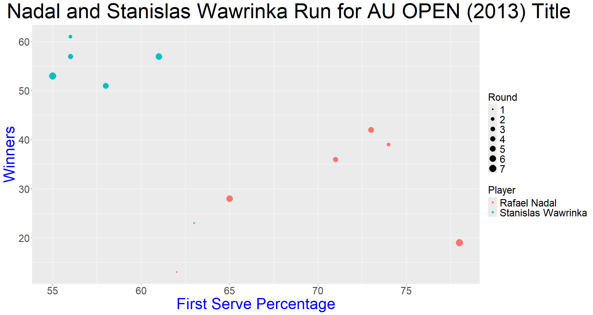
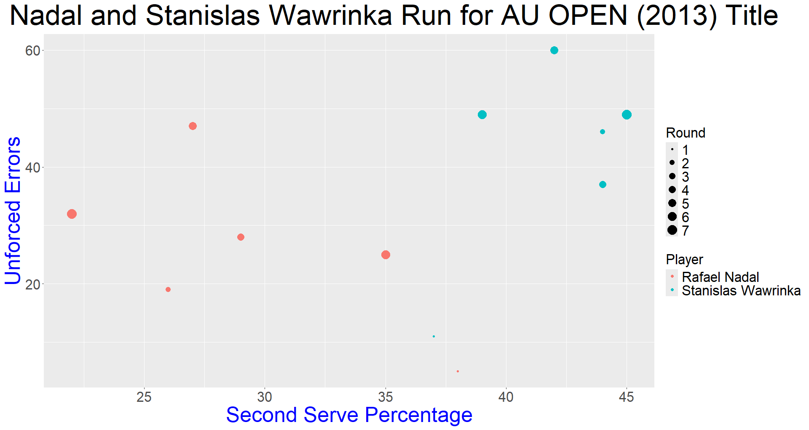
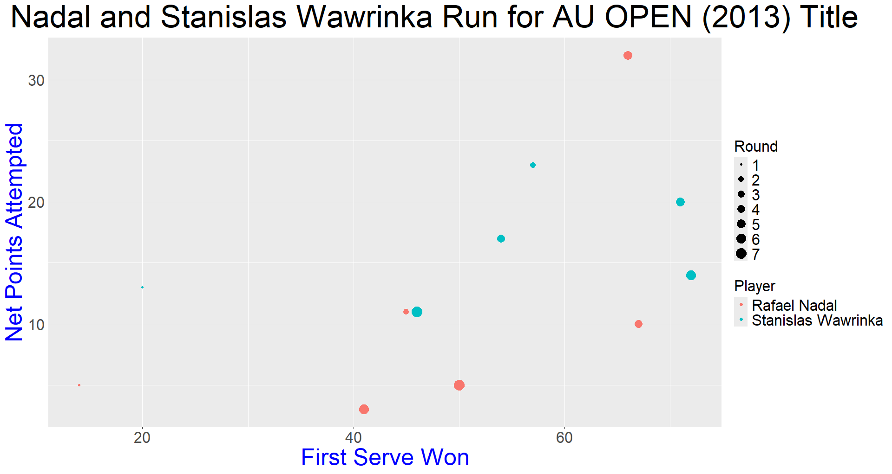

# GrandSlamsClassification
This project explores classification models to analyze match data from Grand Slam tennis tournaments, specifically focusing on player performance metrics such as first serve percentage, aces, winners, break points, and net points attempted.

## Classification ##
In this repository, five different classification methods were analyzed: (1) Logistic Regression, (2) K-Nearest Neighbor (KNN), (3) Support Vector Machine (SVM) - linear method, (4) SVM - Non Linear (rbf) method and (5) Naive Bayes. The classifier was trained using the Australian Open men's (2013) dataset from UC Irvine Machine Learning Repository (https://archive.ics.uci.edu/dataset/300/tennis+major+tournament+match+statistics). 

## A Little bit of Tennis Background ##
In tennis, the four most important tournaments (at least for me) are called Grand Slams (GS). There are four GS, and the order of them happening yearly is: (1) Australian Open (AO), (2) French Open (FO), (3) Wimbledon (W), (4) US Open (UsO). Because AO is the first GS of the year, AO's dataset was used as the training model.

## Things Considered When Looking at the Dataset ##
- The datasets have a total of 42 features. Where each player has 20 features (2 players = 40) and the other two features are "Round" and "Result".
- Features used for data training: (1) Input: First Serve Percentage, Second Serve Percentage, ACE, Winners, Break Points Caused and Net Points Attempted. (2) Output/Target: Result.

## Best Accuracy Classifier ##
The best accuracy obtained from the five different classifier methods used was Logistic Regression (LR). LR gave an accuracy of around 84.4%, so LR was used to predict the "Result" against the actual Result (given the same features) for the other unobserved datasets (FO, W and UsO).

## Results using LR as our classifier ##
- LR was chosen because it gave the highest accuracy against all other classifier methods for this case scenario
- Predicting French Open had an accuracy of around 84%
- Predicting Wimbledon had an accuracy of around 70.2%
- Predicting Us Open had an accuracy of around 80.2%

## Data Visualization using R ##
Visualization of some important features (considered to me) in Tennis are done using the file "visualization.R". Visualization here is done using the AO dataset considering only the two players who reached the final (Rafael Nadal and Stanislas Wawrinka).  

